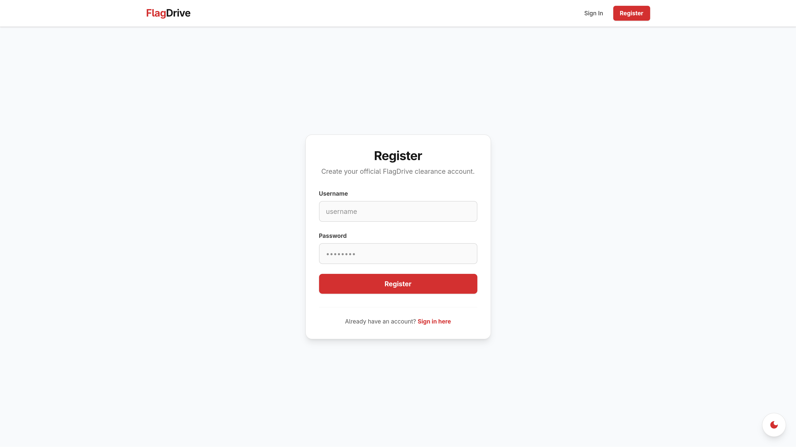
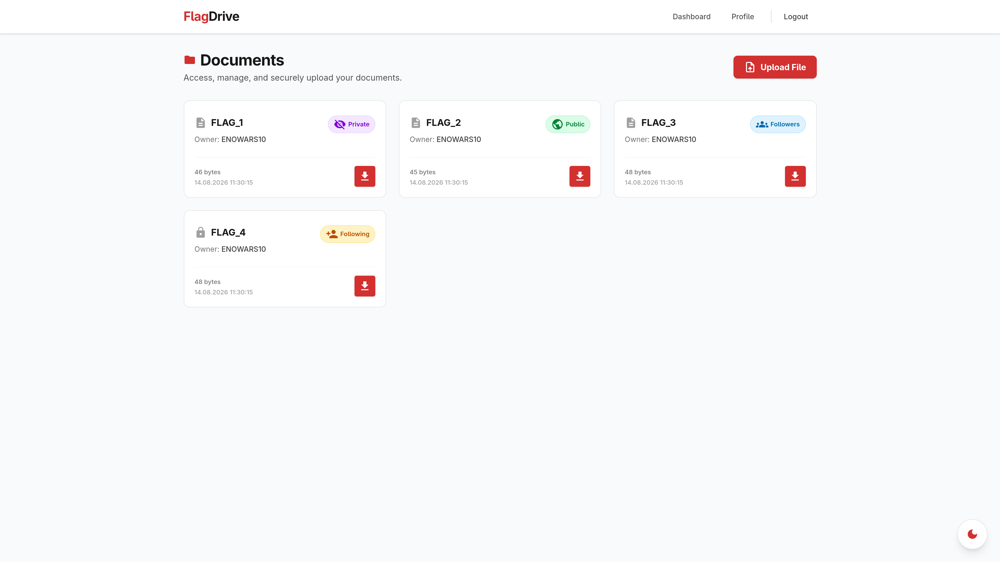
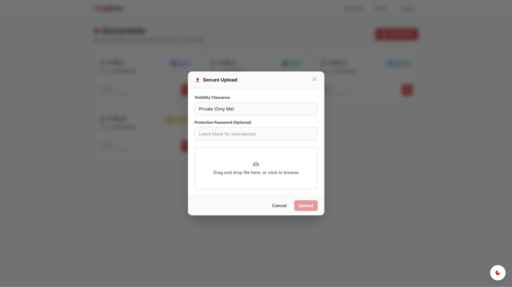
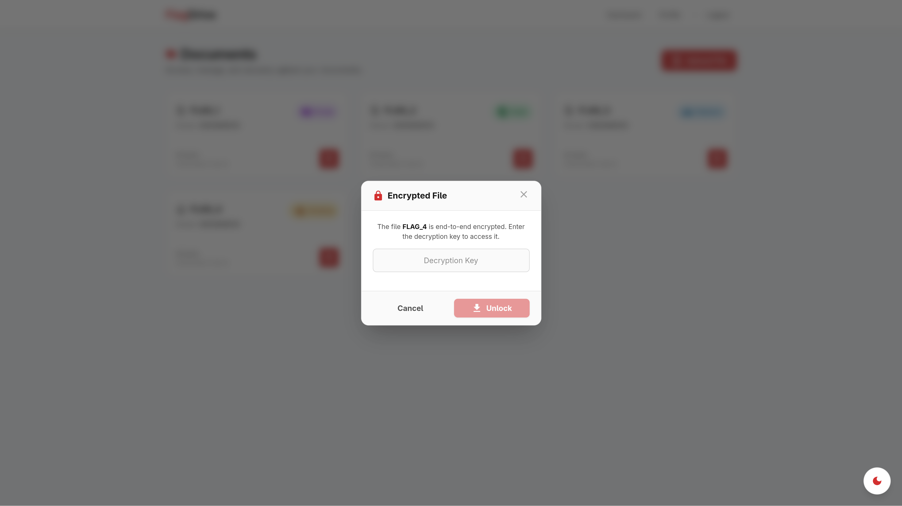
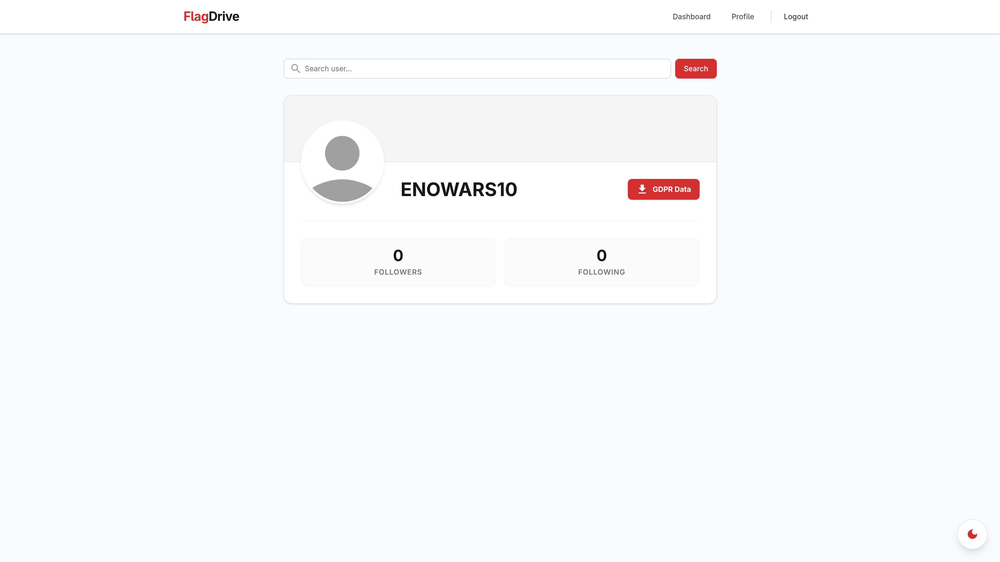
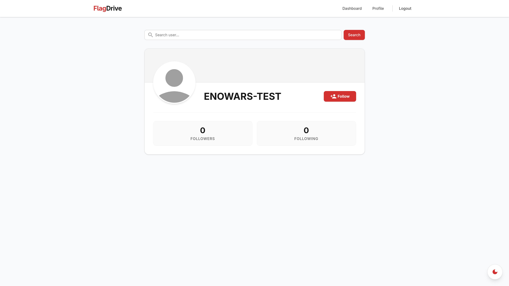

# FlagDrive CTF Service Documentation

- [Introduction](#introduction)
- [Project Structure](#project-structure)
- [How to start the CTF Service](#how-to-start-the-ctf-service)
- [System Architecture](#system-architecture)
- [Flagstores Overview](#flagstores-overview)
- [Usage & Core Features](#usage--core-features)
  - [Account Management & Authentication](#account-management--authentication)
  - [File Uploads & Access Control](#file-uploads--access-control)
  - [GDPR Export](#gdpr-export)
  - [Social Following System](#social-following-system)

---

## Introduction

FlagDrive is a secure, government-hosted document storage and file-sharing portal built for the **ENOWARS10 Attack/Defense CTF**. The application allows users to register, log in, upload and download documents with four different visibility levels (Public, Private, Followers, Following), follow other users, and request GDPR compliance exports.

---

## Project Structure

* `service/`: Application source code (`service/backend`, `service/frontend`, `docker-compose.yml`).
* `checker/`: Service healthchecker and exploit verification scripts (`checker/src/exploit/`).

---

## System Architecture

FlagDrive into two parts, the backend that serves the API and files and the frontend that is only used for the web portal. The backend and frontend are written in Rust.

* **[Backend Architecture](BACKEND.md)**: Tokio runtime, Axum API endpoints, SQLx migrations, and PostgreSQL storage.
* **[Frontend Architecture](FRONTEND.md)**: Leptos WebAssembly SPA and Tailwind CSS v4 styling.

---

## Flagstores Overview

FlagDrive has 3 flagstores:

| Store | Flag Description | Vulnerability Summary | Category | Detailed Writeup & Fix | Patch File | Reference Exploit |
|-------|------------------|-----------------------|----------|------------------------|------------|-------------------|
| **0** | Exported GDPR metadata JSON | Nonce prefix matching allows for an IDOR | Logic / API | [Flagstore 0 Writeup](FLAGSTORE_0.md) | [`patches/FLAGSTORE_0.patch`](patches/FLAGSTORE_0.patch) | [`checker/src/exploit/exploit_0.py`](../checker/src/exploit/exploit_0.py) |
| **1** | File content visible only to users in the following list | Safe Rust borrow checker lifetime transmutation & buffer overflow | Memory / Logic | [Flagstore 1 Writeup](FLAGSTORE_1.md) | [`patches/FLAGSTORE_1.patch`](patches/FLAGSTORE_1.patch) | [`checker/src/exploit/exploit_1.py`](../checker/src/exploit/exploit_1.py) |
| **2** | Encrypted file content (AES-256-GCM) | IV reuse & GHASH tag forgery over $GF(2^{128})$ | Cryptography | [Flagstore 2 Writeup](FLAGSTORE_2.md) | [`patches/FLAGSTORE_2.patch`](patches/FLAGSTORE_2.patch) | [`checker/src/exploit/exploit_2.py`](../checker/src/exploit/exploit_2.py) |

---

## How to start the CTF Service

### Run the Service

```bash
cd service
docker compose up --build -d
```

- **Web Portal + API**: `http://127.0.0.1:4859`

### Run the Checker

```bash
cd checker
docker compose up --build -d
```

- **Checker Port**: `14859`

---

## Usage & Core Features

### Account Management & Authentication
Users register and log in via the web portal or HTTP endpoints (`/api/auth/register`, `/api/auth/login`).



### File Uploads & Access Control
Users can upload files with four visibility levels:
- `Private` (0): Owner only (`FLAG_1`).
- `Public` (1): Anyone (`FLAG_2`).
- `Followers` (2): Followers of file owner (`FLAG_3`).
- `Following` (3): Accounts followed by file owner (`FLAG_4`).

The dashboard displays all uploaded files with their file visibility badges:



Clicking **Upload File** opens the upload configuration modal:



Password protected files require entering a decryption passphrase when downloading:



### GDPR Export
Users can request a metadata JSON file via the web portal or HTTP endpoint (`/api/gdpr/request`) and then download them via the `/api/gdpr/download/<gdpr_id>` endpoint.



### Social Following System
Users can follow or unfollow other accounts via the web portal or HTTP endpoints (`/api/user/{username}/follow`, `/api/user/{username}/unfollow`). 

A user can be serched via the web portal or HTTP endpoint (`/api/user/{username}`).


